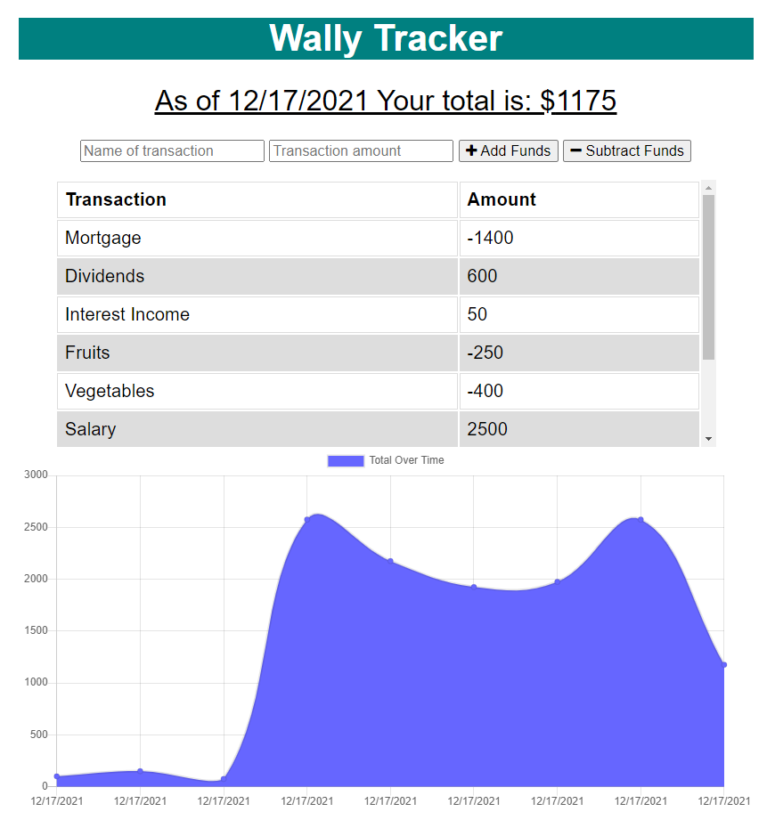
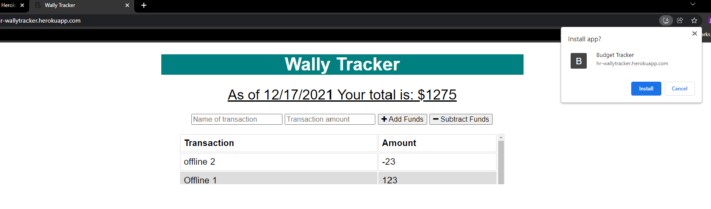
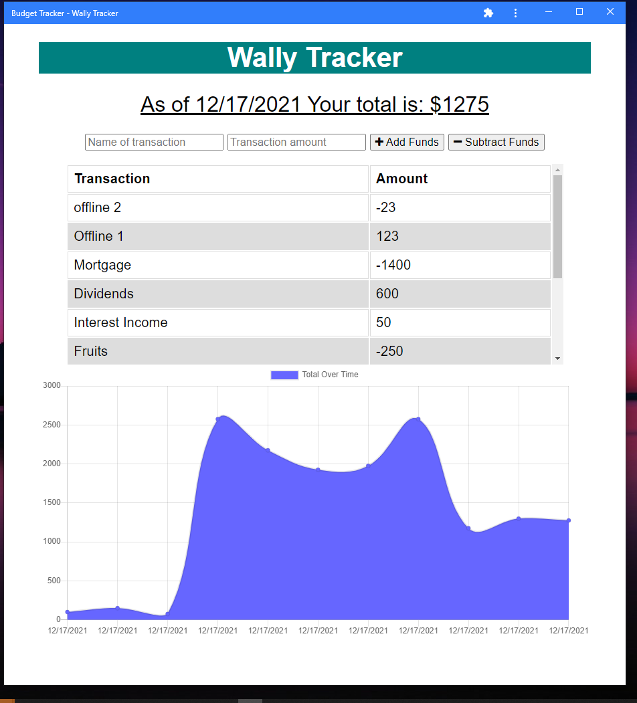
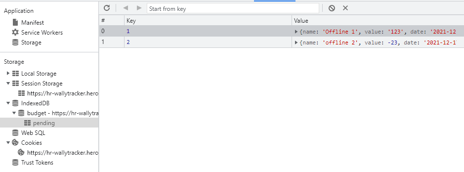
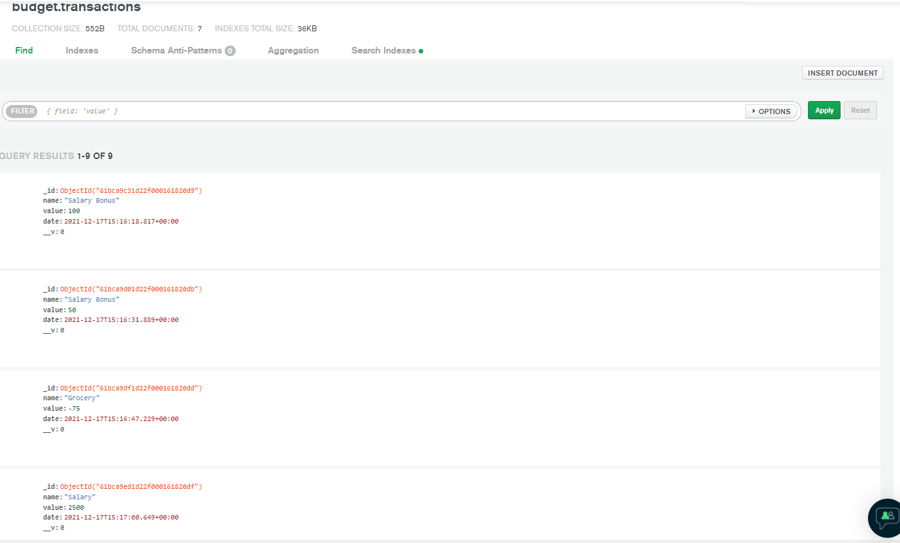

<h1 align = "center">Wally Tracker </h1>

---

1. [Description](#desc)
2. [Web Address](#webaddress)
3. [Usage Tips](#usage)
4. [Features](#feature)
5. [Install Command](#command)
6. [Credits](#credits)
7. [Licenses](#licenses)
8. [Questions and Contributing](#qnacontri)

---

## Description

Wally Tracker is a fast and easy way to track money and allows users to access that information anytime. Wally Tracker provides offline functionality which allows users manage their budget even with out internet access. Wally Tracker can also be installed as Mobile app and Desktop App. 

---

## Web Address

- Deployed on Heroku
  [Wally Tracker](https://hr-wallytracker.herokuapp.com/)

---

## Usage Tips

If you want to run local follow below steps:-

This app is running under MongoDB as a local host for the Database.

1. Download the .zip or clone the Repo
2. Open repo with your favorite Code editor
3. Open terminal and install dependency `npm i`
4. Run the app with `node server.js`
5. Open browser and type http://localhost/PORT (port which you have defined in server.js)

Wally Tracker loads the page, You should be given the option to Add or Subtract Funds.

---

## App Features

### Video Tutorial

[Video Walkthrough](https://drive.google.com/file/d/1Vxb2EsrIWvtGzzGNFwAIDCd1FRSsUi6k/view?usp=sharing)

### Screenshots

#### Home

#### Desktop App

#### Offline/Online 

#### MongoDB Atlas 

## Install Command

To install dependency enter the command "npm i" or npm install" in your terminal

### Dependency

- [express](https://www.npmjs.com/package/express)
- [mongoose](https://www.npmjs.com/package/mongoose)
- [morgan](https://www.npmjs.com/package/morgan)
- [compression](https://www.npmjs.com/package/compression)

### Launch the app

Run following command in your terminal `node server.js`

---

## Credits

[hrsautomation20](https://github.com/hrsautomation20)

---

## Licenses

  

---

## Questions and Contributing

### For Questions please reach out to Repo Owner :-

- GitHub - https://github.com/hrsautomation20
- Email - [H Rola](mailto:hrsautomation20@gmail.com?subject=[GitHub]%20Source%20Han%20Sans)

### For Contributing

Feel free to download or colone the repo and make local changes